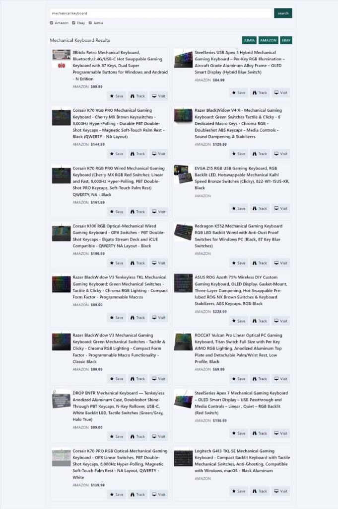

# Python Web based e-commerce automations
This is a project that enables a user to perform a search for a given product on multiple e-commerce platforms(amazon, ebay, jumia) using one search bar. This project takes away the burden of having to manually perform the same search on different site by utilizing web automation tools and rendering the output on one webpage.

## Tools Used
- Python (version 3.9+)
- Django
- HTMX
- Selenium

- Usage: 
```bash
    git clone https://github.com/phillipmugisa/ecommerce-automation.git
    cd ecommerce-automation

    python -m venv venv
    ./venv/Scripts/activate (windows)
    source ./venv/bin/activate (linux)

    python -m pip install -r requirements.txt
```


## setting up product scrapper package
```
    cd ./product_scrapper
    pip install setuptools wheel
    python setup.py sdist bdist_wheel
    pip install .
```
## Setting server
```
    python manage.py runserver
```


## Using the Project
- localhost:8000


